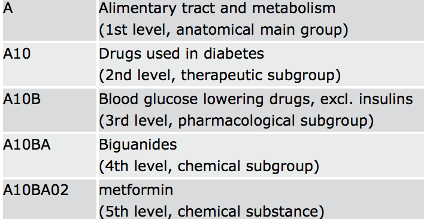
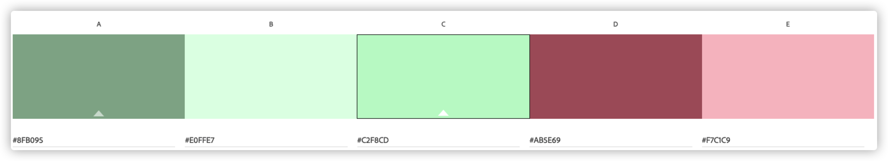
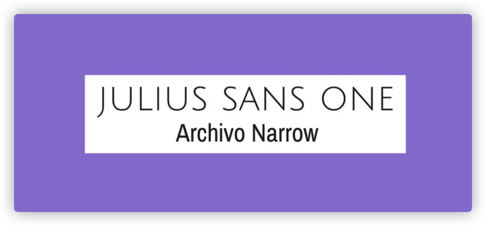

//find a route and directions
ESRI leaflet
https://developers.arcgis.com/esri-leaflet/route-and-directions/find-a-route-and-directions/

# visitPharmacy Application

## Summary

Value proposition

Special consideration

E-pharmacy has been on the rise in Singapore. As such, we would provide a curated list of Health Sciences Authority (HSA) registered online pharmacies. This is to serve as a one-stop portal of legal e-pharmacies to guide the users to right phamacies,as the [rise of illegal/fake online pharmacies](https://www.straitstimes.com/singapore/courts-crime/the-rise-of-illegal-online-pharmacies) poses risks to the uninformed.

---

## Strategy

### target market

This app is designed to target people who want to:

- find locations of registered pharmacies
- acquire information on the over-the-counter (OTC) drugs and pharmacists before making physical visits

Our target groups could be further divided:

1. basic users

Those who only want to find nearby drugstore.

- aged 18 to 50
- adequate IT literacy

2. super users
   Those who wants to get information on OTC drugs, pharmacist background, and e-pharmacy (see special consideration below)

- aged 18 to 40
- high IT literacy
- poly/degree holders and above

### Needs and pain points

- COVID-19 has strained Singapore's hospital system. For many citizens, self-care through pharmacy store has become more viable, especially for the fear of virus infection at hot spots - clinics and hospitals.

- Google allows for pharmacy location search but its search return also includes non-pharmacy results. So this app provide geo location of registered pharmacy with the Singapore government.

- With many people visiting pharmacy, some might already know what drug they want to purchase, but not sure it could be purchased over the counter.

- Some people might prefer e-pharmacy to get the drugs to deliver to their door step. However, there are many illegal online pharmacies, which might cause misuse of drugs or overdose. They need a list of HSA registered e-pharmacy.

- In addition, some people might want to know the registered pharmacist at certain drug store and also to know their experience before consulting them

### User Story

Basic users:

- As I user who works from home, I want to get to nearby pharmacy to get drugs instead of going to clinics or hospitals.

- As a user, I want to search for pharmacy in different areas, so that I could make recommendations to my my parents.

Super users:

- As a user, I know what drugs need, but I am not sure if it can be purchased over the counter (OTC) , I want to check if the drug is OTC or prescription-based, in addition to a brief description of the drug.

- As a user, I also want to know the name of the registered pharmacist, because I want to get a brief consultation from him/her, instead of ramdom picking up drugs myself.

- As a user, I might not want to travel far, so I want to get pharmacist consultation online and get the drugs delivered to home (e-phaemacy).

---

## Scope

Main features

Nearby pharmacy store
Search pharmacy store
Search pharmacy drugs
See a list of HSA registered e-pharmacy

At desk, the 3 buttons should appear on top.
In mobile modes, the 3 buttons should appear below like wechat style.

/ask users for access control in current location
//find nearest pharmacy (Djastra algorithm) and check if the drug is OTC/prescription
//tell them who is the license pharmacist in charge
//remind them to bring NRIC to get pharmacy drugs (bring nric to see pharmacist)

When to use/ mobile responsive
at home, or ont he walk towards pharmacy
computer and mobile consideration

when walking map should include less buttons or feature to distract people.

Main content

## DataSets

1. [GeoJson data from data.gov.sg](https://data.gov.sg/dataset/retail-pharmacy-locations?resource_id=ae46281d-8ee1-4fa3-ab07-03ab409946d8)

This allows us to plot the locations of the pharmacies on the map, and we are also able to identifiy its postal code.

2. [Liscensed pharmacists from data.gov.sg](https://data.gov.sg/dataset/listing-of-licensed-pharmacies);

This allows us to identify the names of the registered pharmacists in various postal codes. Merging with dataset 1, we are able to provide the name of the pharmacist in various locations.

3. [List of registered drugs in Singapore from ](https://data.gov.sg/dataset/listing-of-registered-therapeutic-products)

This allow us to identify if the drug are OTC or prescription-based, so that the users will not have to make wasted trips to the pharmacy. However, there are no efficacy description of the drugs in this dataset, but it does come with WHO's ATC codes on each drug

4. ATC Code level 1 and level 2 list for the drugs (Json)

See [detailed explaination](https://www.who.int/tools/atc-ddd-toolkit/atc-classification) on WHO's website. Simply put, the ATC codes allow us to identify a drug's usage, so that we could provide these information to our app users.

For this dataset, we would gather and create data for level 1 and level 2 codes below. Otherwise, most are paid sources.

_source: WHO_

5. List of available e-pharmacy services

https://www.straitstimes.com/singapore/health/first-hsa-registered-e-pharmacy-in-singapore-launched

https://www.mobihealthnews.com/news/asia/hyphens-pharma-officially-launches-first-hsa-approved-e-pharmacy-singapore

https://www.raffleshealth.com/pharmacy.html

https://www.singhealth.com.sg/patient-care/patient-visitor-info/medicine-delivery-service

https://www.sgh.com.sg/patient-care/visiting-specialist/medication-delivery-singapore-general-hospital

Summary of main data points
xx

---

## Structure

Adopt a tree information structure, centre on the map itself
site map

## Skeleton

most important is map to make it the background

second most important search features

last is search drugs and e-pharmacy

## Surface - visual design

Wireframe

The app should adopt warm color - gives uses some hope, especially for those who are ill.

The app will also adopt a more offcial them, not too fancy color or front.

Font

If you're looking for a smart, professional look, this is a great font pairing to try. Julius Sans One is an all caps font that only comes in one weight, but, with its fine stroke and broader baseline, it's a top choice for a display font. The more geometric Archivo Narrow is a perfect match and works equally well in print and digital.

Icon
