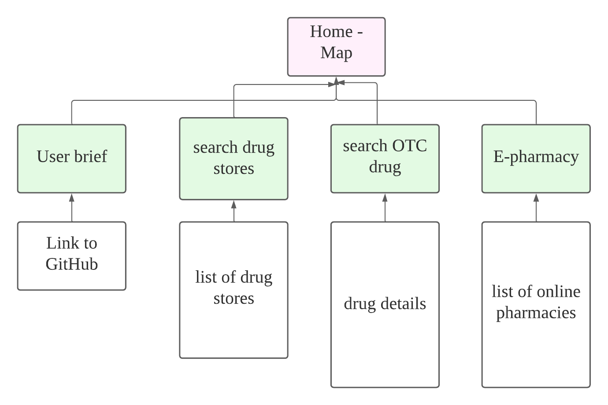

# pharmacy-pal

****Nice picture layout of the app.

Access the live demo [here](https://jerrysuper123.github.io/pharmacy-pal/).

## Summary

Value proposition

Special consideration

E-pharmacy has been on the rise in Singapore. As such, we would provide a curated list of Health Sciences Authority (HSA) registered online pharmacies. This is to serve as a one-stop portal of legal e-pharmacies to guide the users to right phamacies,as the [rise of illegal/fake online pharmacies](https://www.straitstimes.com/singapore/courts-crime/the-rise-of-illegal-online-pharmacies) poses risks to the uninformed.

***
Project Context

Organization goals

User goals

Unique-selling point

## 1. Strategy
this section mainly discusses what???

### target market

This app is designed to target people who want to:

- find locations of registered pharmacies
- acquire information on the over-the-counter (OTC) drugs and pharmacists before making physical visits

Our target groups could be further divided:

1. basic users

Those who only want to find nearby drugstore.

- aged 18 to 50
- adequate IT literacy

2. super users
   Those who wants to get information on OTC drugs, pharmacist background, and e-pharmacy (see special consideration below)

- aged 18 to 40
- high IT literacy
- poly/degree holders and above

### Needs and pain points

- COVID-19 has strained Singapore's hospital system. For many citizens, self-care through pharmacy store has become more viable, especially for the fear of virus infection at hot spots - clinics and hospitals.

- Google allows for pharmacy location search but its search return also includes non-pharmacy results. So this app provide geo location of registered pharmacy with the Singapore government.

- With many people visiting pharmacy, some might already know what drug they want to purchase, but not sure it could be purchased over the counter.

- Some people might prefer e-pharmacy to get the drugs to deliver to their door step. However, there are many illegal online pharmacies, which might cause misuse of drugs or overdose. They need a list of HSA registered e-pharmacy.

- In addition, some people might want to know the registered pharmacist at certain drug store and also to know their experience before consulting them

### User Story

Basic users:

- As I user who works from home, I want to get to nearby pharmacy to get drugs instead of going to clinics or hospitals.

- As a user, I want to search for pharmacy in different areas, so that I could make recommendations to my my parents.

Super users:

- As a user, I know what drugs need, but I am not sure if it can be purchased over the counter (OTC) , I want to check if the drug is OTC or prescription-based, in addition to a brief description of the drug.

- As a user, I also want to know the name of the registered pharmacist, because I want to get a brief consultation from him/her, instead of ramdom picking up drugs myself.

- As a user, I might not want to travel far, so I want to get pharmacist consultation online and get the drugs delivered to home (e-phaemacy).

---

### Features based on user story

breifly describe features

## 2. Scope

****** functional specification
*** content - data set (mentioned in credit)
*** Non-functional
Mobile responsive & fast performance
****

Nearby pharmacy store
Search pharmacy store
Search pharmacy drugs
See a list of HSA registered e-pharmacy

At desk, the 3 buttons should appear on top.
In mobile modes, the 3 buttons should appear below like wechat style.

/ask users for access control in current location
//find nearest pharmacy (Djastra algorithm) and check if the drug is OTC/prescription
//tell them who is the license pharmacist in charge
//remind them to bring NRIC to get pharmacy drugs (bring nric to see pharmacist)

When to use/ mobile responsive
at home, or ont he walk towards pharmacy
computer and mobile consideration

when walking map should include less buttons or feature to distract people.

Main content

## 3. Structure

Adopt a tree information structure, centre on the map itself
site map

Briefly describe the structure ****

## 4. Skeleton
Access the wireframes for mobile, tablet, and laptop display for the website here.****

most important is map to make it the background

second most important search features

last is search drugs and e-pharmacy

## 5. Surface - visual design

why this design etc

The app should adopt warm color - gives uses some hope, especially for those who are ill.

The app will also adopt a more offcial them, not too fancy color or front.

Font

Archivo Black & Roboto
Here we have a pairing of two sans serif fonts. Archivo Black is a grotesque sans serif, which makes it feel slightly imperfect compared to the neo-grotesque and geometric styling of Roboto.

This is a great example of how to use fonts in concord with one another. Yes, they’re two sans serifs, but the imperfect/perfect pairing of their character sets creates a good balance. This would work really well in giving an ecommerce site a youthful and trustworthy vibe.

Icon

## 6. technology stack

table here

Algorithm used

## 7. testing

## 8. deployment
Github

## 9. Limitations and future implementations
- [Use passive event listener](https://web.dev/uses-passive-event-listeners/) - not implemented currently, but could significantly improve the mobile scrolling experience especally on a map

- Leeflet Routing Machine is an open-source project, not suitable for production use. Its server could be stopped without prior notice. To commercialize this project, we might consider paid services.

- The disease and symptom dataset is rather small - less than 50 disease types currently. To improve the predictive accuracy, we might need a larger dataset or implement a back-end server to collect users' info. 

## 10. Credits

We have to give both visual and data-set credits below.

Icons and images:
1. [Fontawesome icon](https://fontawesome.com/) - to embelish the website with icons throughout for better UI UX
2. [Google fronts](https://www.google.com/search?q=google+fonts&oq=google+front&aqs=chrome.1.69i57j0i10j0i512l2j0i10l6.4333j0j4&sourceid=chrome&ie=UTF-8) - to set the primary and secondary font types 
3. [Unsplash images](https://unsplash.com/) - to use it as the landing page background image
4. [Flaticon icons](https://www.flaticon.com/) - to customize the map markers

DataSets:

1. [Pharmacy geoJson CSV data from data.gov.sg](https://data.gov.sg/dataset/retail-pharmacy-locations?resource_id=ae46281d-8ee1-4fa3-ab07-03ab409946d8) - to plot the markers on the map and acess the address info

2. [Liscensed pharmacists API from data.gov.sg](https://data.gov.sg/dataset/listing-of-licensed-pharmacies) - to identify the names of the registered pharmacists

2. [Kaggle disease symptom CSV dataset - credit to Pranay Patil](https://www.kaggle.com/itachi9604/disease-symptom-description-dataset) - to predict users' conditions/diseases based on symptoms selected

2. [Wikipedia API](https://www.mediawiki.org/wiki/API:Main_page) - to retrieve the extract of disease info to display to users

2. [Pexels API](https://www.pexels.com/api/) - to retrieve disease image and display to users

2. [Disease match drug API from Open FDA](https://open.fda.gov/apis/drug/label/) - to match drug for users' conditions

2. [Adverse events data API from Open FDA](https://open.fda.gov/apis/drug/event/) - to plot the trends of drug side effects reported on charts
