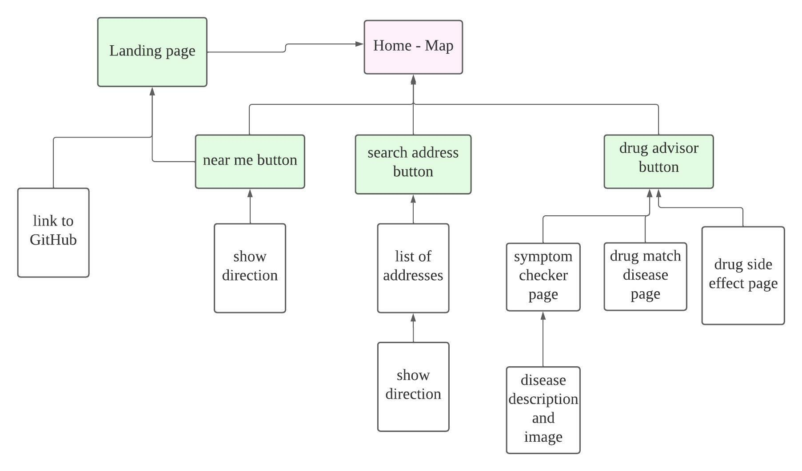
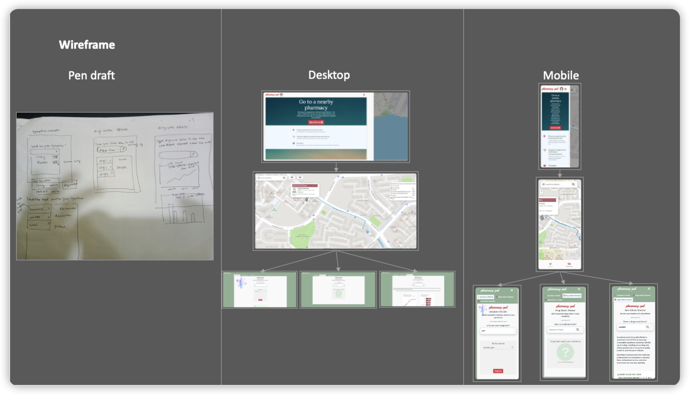
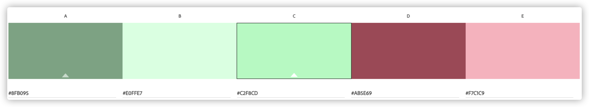
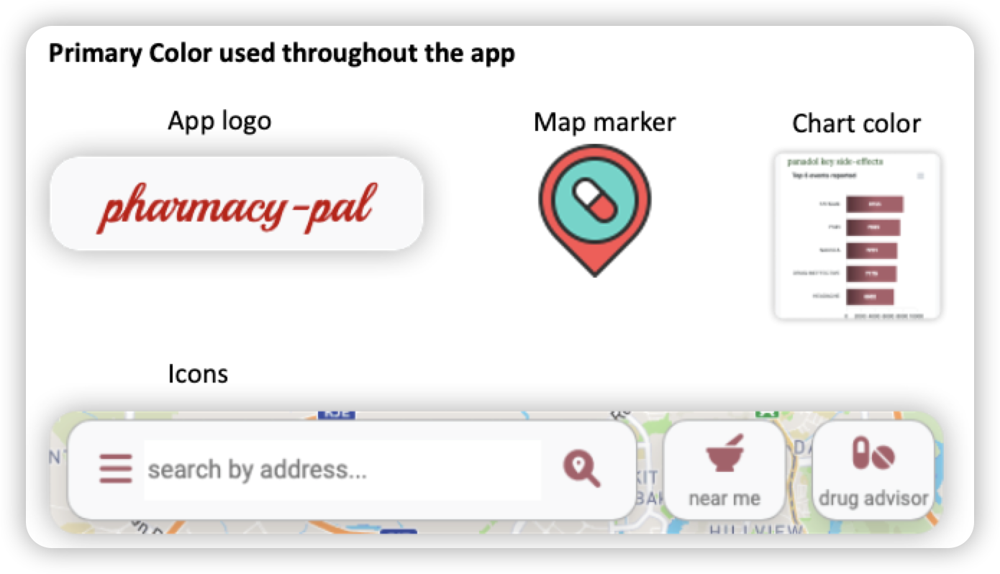

# pharmacy-pal


Access the live demo [here](https://jerrysuper123.github.io/pharmacy-pal/).

## Summary

### Project Context
Reportedly, Covid19 has strained many countries' healthcare system. While in Singapore, to avoid infection hotspots (i.e. clinics or hospitals), many netizens now seek help from pharmacies. However, when Googling for nearby pharmacies, clinics and hospitals often mix up with the results.

Inevitably, many also start using online sources to do symptom diagnosis, at times purchasing drugs on their own. This has paved way for the rising of [illegal online pharmacies](https://www.straitstimes.com/singapore/courts-crime/the-rise-of-illegal-online-pharmacies), definitely a cause for concern.

### Value proposition and objective
Pharmacy-pal is designed to aid "self-care through pharmacy" in the pandemic. Not only does it provide the direction for the nearby pharmacy, it also offers symptom diagnosis & medication recommendation.

## 1. Strategy
This section mainly discusses: 
- App creator's objective and users' needs match-fit
- Users' pain points and app features designed to resolve them

### target market
The target market could be segmented into:

1. basic users

Those who only want to find the nearby drugstore.

- aged 18 to 50
- adequate IT literacy

2. super users

Those who wants to get information on the pharmacist's background and require symptom diagnosis & medication search-up.

- aged 18 to 40
- high IT literacy
- poly/degree holders and above

### Needs and pain points

- For many citizens, self-care through pharmacy has become a norm, but they are not getting adequate services compared to clinics and hospitals.

- Google's search results do not yield a pure-pharmacy list, confusing for many. In fact, many times there is a drug store within 1 KM, but the search result recommends a distance location.

- With many people visiting pharmacies, some require symptom diagnosis and medication recommendation before meeting the pharmacist for a more fruitful discussion.

- Many want to know the registered pharmacist in service before making the physical trips, rather than accepting cashiers' advices in store.

### User stories
Based on the aforementioned pain points, access the user-story list [here](https://github.com/Jerrysuper123/pharmacy-pal/blob/main/READMESources/userStory.pdf).

### Features based on user story

1. Display the route from user's location to the nearest pharmacy
2. Provide pharmacists' names based on locations
3. Offer symptom diagnosis and description of possible conditions
4. Recommend possible medications for the users' conditions
5. Display the drug side-effect statistics to users

## 2. Scope
### Functional specification
It would be based on the aforementioned features.

### Content
The main content are similar as described in the features section.

For more details on info content used, refer to the credits section below for the list of data sources.

### Non-functional
- The app should be mobile responsive, as users might be on the go towards the pharmacy location.
- When in mobile format, the screen should have less buttons/features to prevent accidental press while walking.

## 3. Structure
Opted for a tree information structure, with the map as the home page.



## 4. Skeleton



## 5. Surface - visual design
### Colors
As this is a medical app, we have chosen colors resembling hospital or medical theme below.


Using the above color wheel, we have set the colors in the _constant.scss file to be global variables - to be used consistently through the application.
- ColorPrimary is used the mostly throughout the app, including the app logo design, icon color, and data chart theme (see below)
- ColorAccentThree is mostly used as the background color e.g. the drug advisor page background color.
- The rest of the colors are also widely used, but mostly as supporting hues.
```
/* color setting */
$colorPrimary: #ab5e69;
$colorSecondary: #c2fbcd;
$colorAccentOne: #F7c1c9;
$colorAccentTwo: #E0ffe7;
$colorAccentThree: #8fb095;
```

PrimaryColor consistency


### Font pair - Lora and Roboto 

Although they are two sans serifs, but the imperfect/perfect pairing of their character sets creates a good balance. This would work really well in giving a youthful and trustworthy vibe.


Against, in the _constant.scss file, we have set below font variables to be used globally.
```
/* font family and size setting */
$headerFront: 'Lora', serif;
$bodyTextFront: 'Roboto', sans-serif;
```

## 6. technology stack
### Stack used:

| Tech  | Usage |
| ------------- | ------------- |
| HTML, CSS, vanilla Javascript, Bootstrap 5  | Build the main frame of the website  |
| SASS  | Organize and structure css  |
| [Axios](https://axios-http.com/docs/intro)  | Call APIs  |
| [Apexcharts](https://apexcharts.com/)  | Plot charts of drug side effects reported  |
| [Leaflet](https://leafletjs.com/)  | Create map and markers  |
| [Leaflet routing machine](https://www.liedman.net/leaflet-routing-machine/)  | Draw routes on the map |
| Fontawesome  | Use icons throughout the site  |


### Algorithm used:
| Algorithm  | Usage |
| ------------- | ------------- |
| [Check if an array is a subset of another array](https://www.geeksforgeeks.org/find-whether-an-array-is-subset-of-another-array-set-1/)  | Match symptoms selected to disease types  |
| Linear algorithm to calculate the shortest distance between two nodes  | Display nearest pharmacy to user, but time complexity could be improved |

## 7. testing
Click [here](https://github.com/Jerrysuper123/pharmacy-pal/blob/main/READMESources/testCases.pdf) for the detailed test list.

## 8. deployment
The deployment is done through Github with the instructions [here](https://gist.github.com/TylerFisher/6127328).

## 9. Limitations and future implementations
- [Use passive event listener](https://web.dev/uses-passive-event-listeners/) - not implemented currently, but could significantly improve the mobile scrolling experience especally on a map

- Leeflet Routing Machine is an open-source project, not suitable for production use. Its server could be halted without prior notice. To commercialize this project, we might consider paid services.

- The disease and symptom dataset is rather small - less than 50 disease types currently. To improve the predictive accuracy, we might need a larger dataset or implement a back-end server to collect users' info. 

## 10. Credits

For both visual and data-set credits below:

Icons and images:
1. [Fontawesome icon](https://fontawesome.com/) - to embelish the website with icons throughout for better UI UX
2. [Google fronts](https://www.google.com/search?q=google+fonts&oq=google+front&aqs=chrome.1.69i57j0i10j0i512l2j0i10l6.4333j0j4&sourceid=chrome&ie=UTF-8) - to set the primary and secondary font types 
3. [Unsplash images](https://unsplash.com/) - to use it as the landing page background image
4. [Flaticon icons](https://www.flaticon.com/) - to customize the map markers

DataSets:

1. [Pharmacy geoJson CSV data from data.gov.sg](https://data.gov.sg/dataset/retail-pharmacy-locations?resource_id=ae46281d-8ee1-4fa3-ab07-03ab409946d8) - to plot the markers on the map and acess the address info

2. [Liscensed pharmacists API from data.gov.sg](https://data.gov.sg/dataset/listing-of-licensed-pharmacies) - to identify the names of the registered pharmacists

3. [Kaggle disease symptom CSV dataset - credit to Pranay Patil](https://www.kaggle.com/itachi9604/disease-symptom-description-dataset) - to predict users' conditions/diseases based on symptoms selected

4. [Wikipedia API](https://www.mediawiki.org/wiki/API:Main_page) - to retrieve the extract of disease info to display to users

5. [Pexels API](https://www.pexels.com/api/) - to retrieve disease image and display to users

6. [Disease match drug API from Open FDA](https://open.fda.gov/apis/drug/label/) - to match drug for users' conditions

7. [Adverse events data API from Open FDA](https://open.fda.gov/apis/drug/event/) - to plot the trends of drug side effects reported on charts
